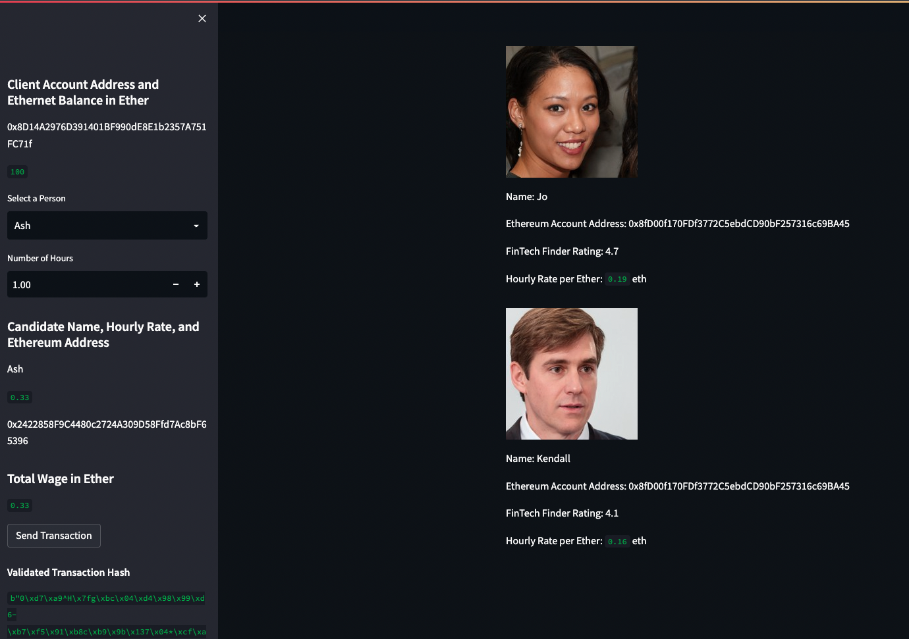
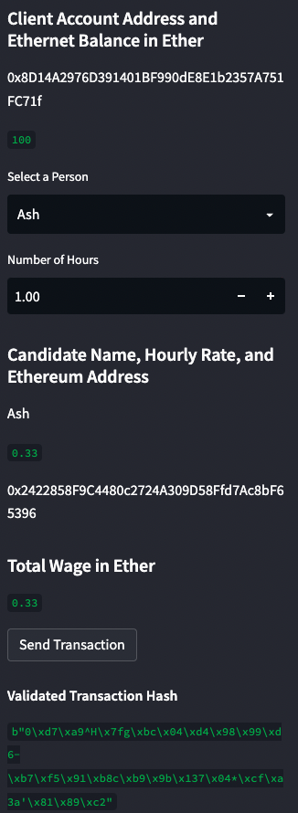
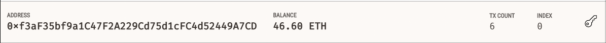
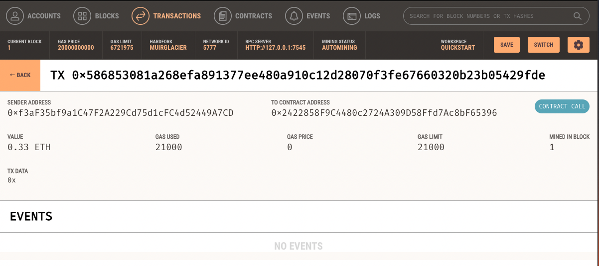
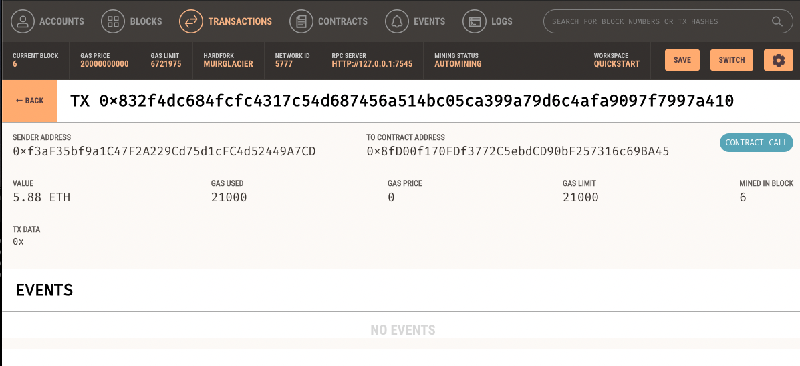

# Cryptocurrency Wallet
This prototype Streamlit is an application consists of a user-friendly web interface that its customers can use to find fintech professionals from among a list of candidates, hire them, and instantly pay them with the Ether cryptocurrency. This allows customers to send cryptocurrency payments to fintech professionals. 

## Technologies

* Python 3.7
* Streamlit
* web3
* bip44
* Ganache

## Examples
**Fintech Finder Database:**

After running the Streamlit application,  users will be presented with a screen showing a database of  fintech professionals available for hire. Information about each Fintech Professional featured includes a photo,  name, Ethereum account address,  rating, and  hourly rate per Ether. 

**Client Account & Available Candidates:**

You will see a sidebar showing the client's account address and their Ethereum balance in Ether, along with the ability to select  fintech experts from a dropdown list and enter the number of hours to hire them. Selecting a person from the list will display the candidate's name, hourly wage, and Ethereum address. Entering a value in the Hours input field updates the Total Wage in Ether with the calculated value. The client can change the candidates selected  from the list in the same number of hours  to compare the calculated total wages. Alternatively, you can change the number of hours for a specific candidate to update the calculated total wage value.

**Send Transaction:**

Once the client is satisfied with the selected candidate and the calculated total wage, the client can click the "Send Transaction" button to hire the candidate, and instantly pay them with the Ether cryptocurrency by sending an authorized (signed) transaction to the Ganache blockchain. A "Validated Transaction Hash" is then shown on the sidebar below the "Send Transaction" button to confirm that the transaction was successful, communicated to Ganache, validated, and added to a block.

Following are screenshot of the client's account (index 0) from the Ganache accounts tab. They show the client's ethereum account address and their balance after completing  6th (tx count) send transactions.

Lastly, the screenshots below are of the transaction details from the Ganache transactions tab of the 1st and 6th send transactions. They show the transaction hash, the client's (sender) address, the fintech professional's (to contract) address, the value in Ether that was sent to the fintech professional's address, and the block in which the transaction was mined. 

